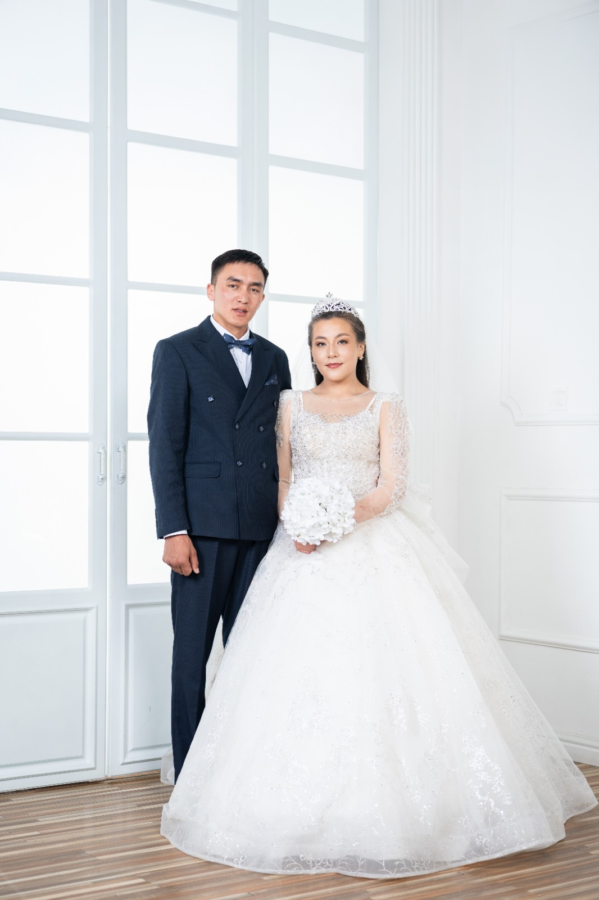
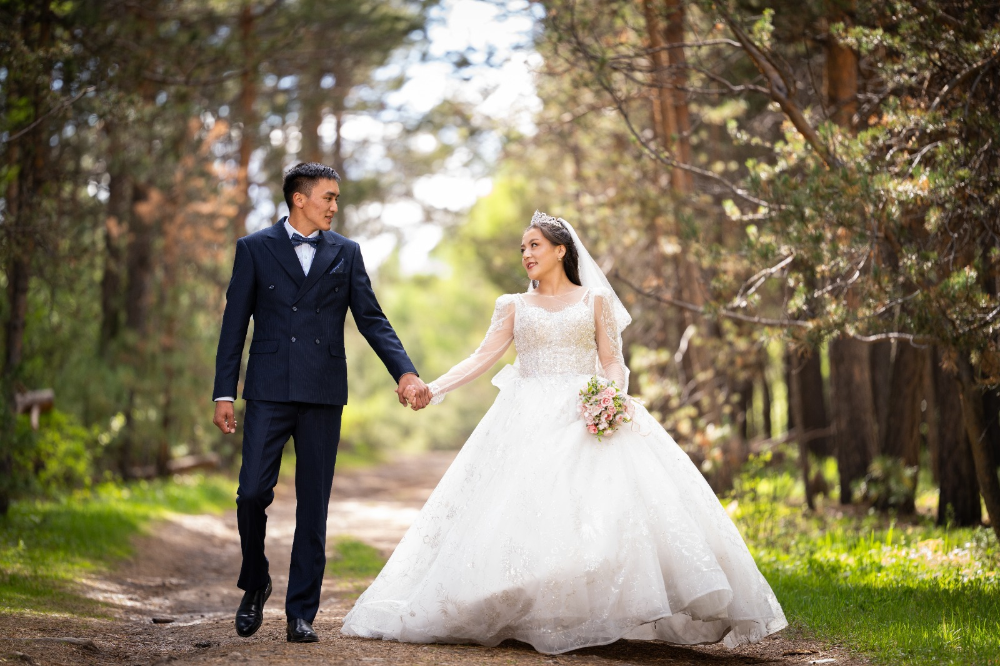
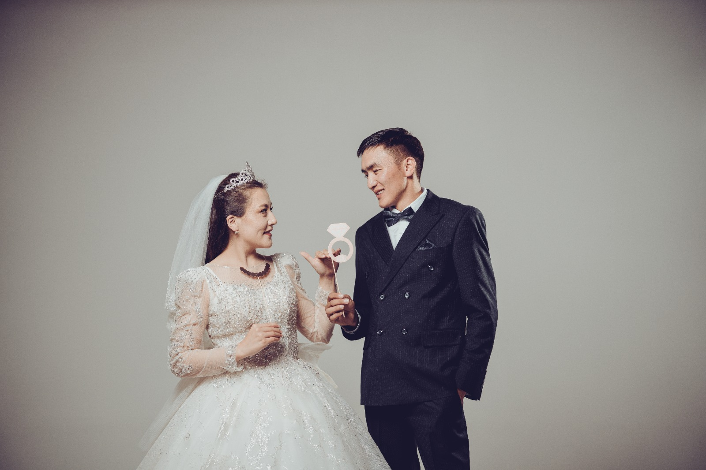

<!DOCTYPE html>
<html lang="kk">
<head>
    <meta charset="UTF-8">
    <meta name="viewport" content="width=device-width, initial-scale=1.0">
    <title>Жандос & Айжарық — Тойға шақыру</title>
    
</head>
<body>

    

        <h1>ТОЙҒА ШАҚЫРУ</h1>
        
        <button class="music-btn" id="musicBtn" onclick="toggleMusic()">🎵 Музыканы қосу</button>
        <audio id="bgMusic" loop>
            <source src="https://muznavo.net/music/dl/zigitter_toby_-_ak_bosaga_(muznavo.net).mp3" type="audio/mp3">
        </audio>

        

            
            
            
            
            
            
        

        

            
Құрметті ағайын-туыс, құда-жекжат, дос-жаран!

            
            

                Жандос
                &
                Айжарық
            

            
Балаларымыздың үйлену тойына арналған ақ дастарханымыздың <strong>Қадірменді Қонағы</strong> болуға шақырамыз.

            
            

            
            
ӨТЕТІН УАҚЫТЫ:

            
2026 жыл, 24 Маусым (6-шы айдың 24-і) Сағат 17:00-де

            
            
МЕКЕН-ЖАЙЫ:

            
«Алтын-Орда» той сарайы

            
            

            
            
ТОЙ ИЕЛЕРІ:

            
Ата-анасы: Хобыланды — Меруерт

        

    

    

</body>
</html>
